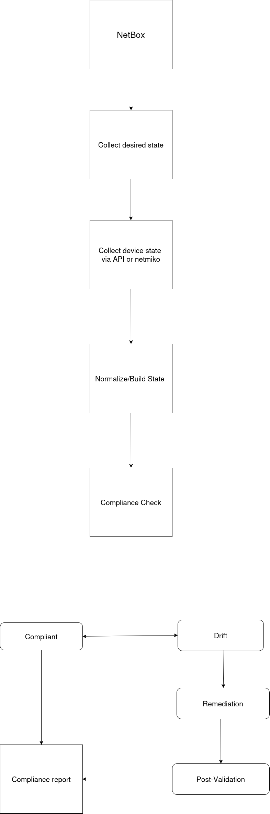

# Network Automation & Compliance Engine

A Python-based network automation and configuration compliance engine that uses **NetBox as a source of truth** to compare desired state against live network devices.

It detects configuration drift, remediates non-compliant configurations, and post-validates changes across multiple network management protocols.



## Features

- **NetBox source of truth** for inventory and desired configuration
- **Multi-transport automation**
  - Netmiko / SSH
  - NETCONF
  - RESTCONF
- **Desired-state compliance checking**
- **Automatic configuration remediation**
- **Post-remediation validation**
- **Dependency-aware execution pipeline**
- **DRY_RUN support** for safe remediation testing
- **Concurrent device processing**
- **Structured logging**
- **JSON and text compliance reports**
- **Unit and live integration testing with pytest**

### Network Features

- VLANs, access ports, and trunk ports
- STP and interface protection
- EtherChannel / LACP / PAgP
- Port Security
- DHCP Snooping / Dynamic ARP Inspection
- CDP
- OSPF
- HSRP
- NAT
- Static Routing
- DHCP
- QoS
- NTP
- SNMP
- Syslog

## Technology Stack

| Category | Technologies |
|---|---|
| Language | Python 3 |
| Source of Truth | NetBox / pynetbox |
| CLI Automation | Netmiko |
| Model-Driven Automation | NETCONF / ncclient, RESTCONF |
| Data Models | YANG |
| Configuration Templates | Jinja2 |
| Configuration Parsing | CiscoConfParse |
| XML Processing | xmltodict |
| Testing | pytest |
| Concurrency | ThreadPoolExecutor |

## Project Structure

```text
.
├── src/
│   ├── collectors/
│   │   └── cli/
│   │       └── builders.py
│   ├── compliance/
│   └── ...
│
├── templates/
│   └── *.j2
│
├── tests/
│   ├── unit/
│   └── integration/
│
├── docs/
│   └── images/
│       └── automation_diagram.png
│
├── requirements.txt
└── ...
```

## Installation

```bash
git clone <repository-url>
cd <repository-directory>

python3 -m venv .venv
source .venv/bin/activate

pip install -r requirements.txt

## Configuration

Configure credentials and connection information through environment variables.

**Do not commit credentials, API tokens, passwords, or `.env` files to Git.**

```bash
export NETBOX_URL="http://localhost:8000"
export NETBOX_TOKEN="your-token"

export NA_HOST="192.168.1.10"
export NA_USER="username"
export NA_PASS="password"
export NA_TYPE="cisco_ios"
```
Adjust the variables to match the configuration expected by the implementation.

## Configuration

Configure credentials and connection information through environment variables.

**Do not commit credentials, API tokens, passwords, or `.env` files to Git.**

```bash
export NETBOX_URL="http://localhost:8000"
export NETBOX_TOKEN="your-token"

export NA_HOST="192.168.1.10"
export NA_USER="username"
export NA_PASS="password"
export NA_TYPE="cisco_ios"
```

Adjust the variables to match the configuration expected by the implementation.

## Running

```bash
python Hybrid_Automation.py
```

The engine:

    1. Retrieves inventory and desired state from NetBox
    2. Connects to each device using its configured transport
    3. Collects the appropriate device state
    4. Builds a normalized representation
    5. Runs the compliance pipeline
    6. Remediates configuration drift when required
    7. Re-collects state after remediation
    8. Post-validates the resulting configuration
    9. Generates compliance reports

## Testing

### Unit Tests

```bash
pytest tests/unit -q
```

### Integration / Live Tests

```bash
pytest tests/integration -m live
```

Live tests require a reachable test device and appropriate credentials. Run them against a lab device before using them with production infrastructure.

## Output

```text
final_compliance_report.json
network_compliance_report.txt
```

## Disclaimer

This project is intended for **lab, development, and controlled network environments**.

Test automation and remediation thoroughly before deploying against production infrastructure.
